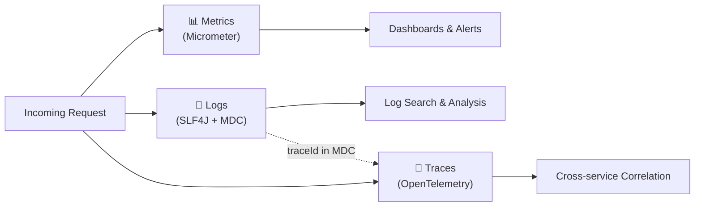

# Observability Rules

## The Three Pillars

- Every service must emit **metrics**, **logs**, and **traces**.
- Use Micrometer for metrics, SLF4J for logging, and OpenTelemetry (or Micrometer Tracing) for distributed traces.
- Observability instrumentation should not affect business logic — keep it in interceptors, aspects, or decorators.

## Metrics

### Naming Conventions

- Use Micrometer/Prometheus naming: `snake_case`, dot-separated namespace.
- Format: `<application>.<component>.<action>.<unit>` (e.g., `myapp.upload.duration.seconds`).
- Use standard suffixes: `.total` (counters), `.seconds` (durations), `.bytes` (sizes).
- Timer names describe what is being timed (e.g., `grpc.server.call.duration`).

### Required Metrics (RED Method)

- **Rate** — Request count per endpoint/RPC (`grpc.server.calls.total`).
- **Errors** — Error count by status code (`grpc.server.calls.error.total`).
- **Duration** — Latency histograms with p50, p95, p99 (`grpc.server.call.duration.seconds`).
- Add **saturation** metrics for bounded resources (thread pools, connection pools, disk usage).

### Cardinality Rules

- Never use unbounded values as metric labels (no file IDs, user IDs, UUIDs, timestamps).
- Allowed labels: RPC method name, status code, error type, content type.
- Maximum ~10 unique values per label dimension.
- High-cardinality data belongs in logs/traces, not metrics.

### Custom Metrics

- Instrument business-critical operations (uploads completed, bytes stored, active sessions).
- Use `Counter` for events, `Timer` for durations, `Gauge` for current state, `DistributionSummary` for sizes.
- Register metrics via `MeterRegistry` injection — do not create global static meters.

## Distributed Tracing

### Span Creation

- Create spans for cross-service calls, database queries, and external I/O.
- gRPC interceptors should propagate trace context automatically.
- Add spans manually only for significant internal operations (not every method call).

### Context Propagation

- Use W3C Trace Context (`traceparent` header) for inter-service propagation.
- Propagate trace/span IDs through async boundaries (virtual threads, `@Async`).
- Include `traceId` in all log output via MDC for log-trace correlation.

### Span Attributes

- Add domain-relevant attributes: `file.id`, `file.size`, `rpc.method`.
- Do not add PII or secrets as span attributes.
- Keep attribute cardinality bounded (same rules as metric labels).

## Structured Logging (MDC)

### Required MDC Fields

- `traceId` — Distributed trace ID for cross-service correlation.
- `spanId` — Current span for intra-service correlation.
- `rpc.method` — gRPC method name (e.g., `CreateOrder`).
- `request.id` — Unique request identifier.
- Set MDC fields in interceptors at request entry; clear on request completion.

### Log Format

- Use JSON-structured logging in production (Logback JSON encoder).
- Include timestamp, level, logger, thread, message, MDC fields, and exception (if present).
- Human-readable format is acceptable for local development only.

## Health & Readiness

- Expose `/actuator/health` for HTTP probes and `grpc.health.v1.Health` for gRPC probes.
- Custom `HealthIndicator` for each critical dependency (database, storage, external services).
- Health checks must be lightweight — no expensive queries or full system scans.
- Separate liveness (process alive) from readiness (can serve traffic).

## Alerting & SLIs

- Define SLIs for critical operations: availability, latency, error rate.
- Instrument code so that SLI metrics are directly queryable (e.g., `rate(errors) / rate(requests)`).
- Add metadata to errors (error category, retryable flag) to support actionable alerts.
- Avoid alert fatigue — only emit ERROR-level logs for conditions that require human intervention.

## Dashboard Best Practices

- Every service should have a standard dashboard showing RED metrics.
- Include resource utilization panels: JVM heap, GC pauses, thread count, connection pool usage.
- Use consistent panel layouts across services for quick pattern recognition.
