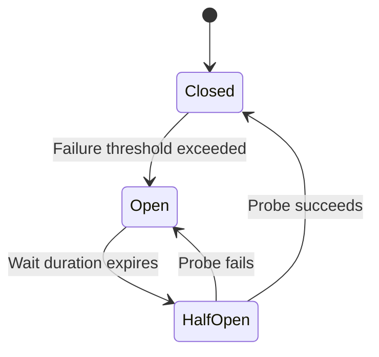
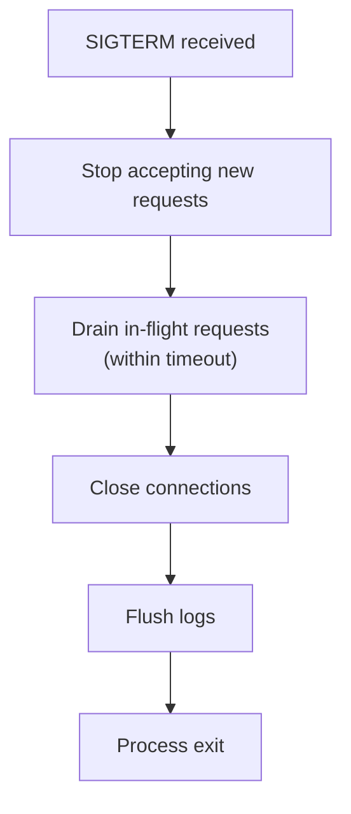

# Resilience Rules

## Timeouts

- **All external calls must have timeouts** — Database queries, HTTP clients, gRPC calls, file I/O.
- Set explicit connect and read timeouts; never rely on system defaults (which may be infinite).
- Use gRPC deadlines for client-to-server timeout propagation.
- Log when timeouts are hit to aid diagnosis.

## Retry & Backoff

- Retry only on transient failures (`UNAVAILABLE`, connection reset, temporary I/O errors).
- Do **not** retry on client errors (`INVALID_ARGUMENT`, `NOT_FOUND`, `PERMISSION_DENIED`).
- Use exponential backoff with jitter to prevent thundering herd.
- Set a maximum retry count (typically 3) to prevent infinite loops.
- Make retried operations idempotent.

## Circuit Breakers

- Use circuit breakers for calls to external services or unreliable dependencies.
- Define failure thresholds, open duration, and half-open probe count.
- Provide fallback behavior when the circuit is open (degraded response, cached data, or clear error).
- Monitor circuit breaker state transitions with metrics/logs.

## Graceful Degradation

- Services should remain partially functional when non-critical dependencies fail.
- Classify dependencies as critical (must fail request) or non-critical (can degrade).
- Return partial results with appropriate indicators rather than failing entirely when possible.

## Graceful Shutdown

- Handle `SIGTERM` to initiate graceful shutdown.
- Stop accepting new requests, finish in-flight requests within a timeout.
- Close resources in order: stop listeners → drain work → close connections → flush logs.
- Configure Spring's `server.shutdown=graceful` and shutdown timeout.

## Health Checks

- Implement separate liveness and readiness probes.
- **Liveness** — Application process is alive and not deadlocked.
- **Readiness** — Application can serve traffic (dependencies are reachable).
- Health checks must be lightweight and not create load on downstream systems.
- Return unhealthy if critical dependencies are unreachable.

## Resource Protection

- Set maximum concurrent request limits to prevent resource exhaustion.
- Configure connection pool sizes with sensible maximums.
- Enforce request size limits at the entry point (gRPC `maxInboundMessageSize`).
- Use bulkheads to isolate critical paths from non-critical ones.

## Rate Limiting

- Enforce per-client rate limits at the entry point (an early `ServerInterceptor`) to protect the
  service from abusive or runaway callers, independent of the global concurrency cap above.
- Key limits by authenticated principal or API key; fall back to remote address only when no
  identity is available.
- Reject throttled calls with `RESOURCE_EXHAUSTED` and a clear (non-leaking) message; where the
  protocol allows, hint at a retry-after interval.
- Apply stricter limits to expensive RPCs (e.g., file uploads, streaming downloads) than to
  cheap metadata reads (e.g., get metadata, list queries).
- Prefer a token-bucket or sliding-window algorithm; keep the limiter state thread-safe and, for
  multi-instance deployments, backed by a shared store rather than per-instance memory.
- Emit metrics for throttled vs. accepted calls (bounded labels, see `OBSERVABILITY.md`) so limits
  can be tuned and abuse detected.
- Exempt health checks from rate limiting.

## Idempotency

- Design mutating operations to be safely retryable.
- Use unique request IDs or natural keys to detect duplicate submissions.
- Return the same result for repeated identical requests without side effects.
