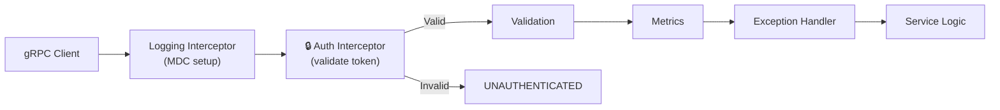

# Authentication, Authorization & Transport Security Rules

> Current state: the gRPC server runs **plaintext** with **reflection enabled** and **no
> authentication** (see `application.yml` and `README.md`). That is acceptable for local
> development only. These rules define what must be true before the service is exposed on any
> shared or production network.

## Transport Security (TLS)

- Terminate TLS on the gRPC server in every non-local environment; never expose plaintext gRPC
  over an untrusted network.
- Prefer mutual TLS (mTLS) for service-to-service traffic; validate the client certificate chain
  and reject unknown issuers.
- Load certificates and private keys from a secret manager or mounted secret — never from the repo
  or an unencrypted config value (see `SECURITY.md` → Sensitive Data).
- Disable gRPC reflection in production (`grpc.server.reflection-service-enabled: false`) unless a
  specific, access-controlled need exists.
- Keep plaintext/reflection settings profile-scoped (e.g., enabled only in `application-local.yml`).

## Authentication

- Authenticate every RPC except explicitly public ones (e.g., `grpc.health.v1.Health/Check`).
- Enforce authentication in a dedicated `ServerInterceptor` placed **early** in the chain — before
  validation and business logic, after logging/MDC so failures are traced. Order today is
  logging → validation → metrics → exception handling; auth belongs immediately after logging.
- Read credentials from gRPC `Metadata` (e.g., an `authorization` bearer token); never from message
  fields.
- Reject missing or invalid credentials with `UNAUTHENTICATED`. Do not leak whether a principal
  exists or why validation failed beyond a generic message.
- Keep the authenticated principal in a request-scoped `Context` key, not in mutable shared state
  (see `CONCURRENCY.md`). Propagate it across async/virtual-thread boundaries.
- Never log tokens, credentials, or full `authorization` headers; mask them (see `OBSERVABILITY.md`).

## Authorization

- Authorize **after** authentication and **before** the operation executes; deny by default.
- Map authorization failures to `PERMISSION_DENIED` (distinct from `UNAUTHENTICATED`).
- Enforce resource-level ownership checks for mutating or sensitive operations — a caller must not access another principal's resources
  by guessing a resource ID. UUID keys reduce enumeration risk but are not an access control.
- Centralize authorization policy; do not scatter ad-hoc role checks through service methods.
- Add the principal/subject to MDC (non-PII identifier) for audit correlation, and emit an
  audit log for security-relevant actions (delete, move, permission denials).

## Configuration & Secrets

- All auth/TLS settings must be externalized via `@ConfigurationProperties` and validated at startup
  (see `SPRING_CONFIGURATION.md`).
- Default to secure: an unset or misconfigured auth setting in a production profile should fail
  startup, not silently disable auth.

## Testing

- Integration tests must cover: unauthenticated call → `UNAUTHENTICATED`, wrong principal accessing
  another's file → `PERMISSION_DENIED`, and a valid authenticated/authorized happy path.
- Keep auth disabled or stubbed in the `test` profile only via explicit, obvious configuration.