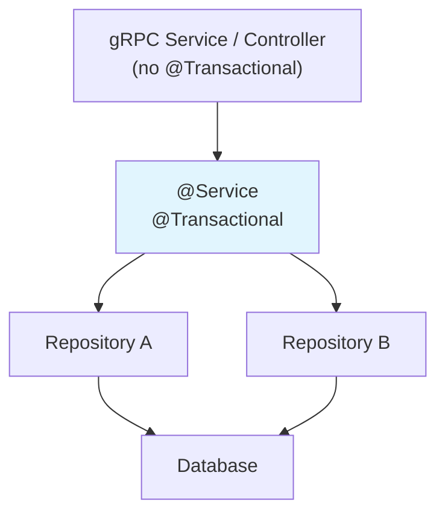

# Database & JPA Rules

## Entity Design

- Entities must have a no-arg constructor (JPA requirement); use `protected` visibility.
- Use `UUID` for primary keys to avoid enumeration attacks and simplify distributed systems.
- Mark entities as `@Entity` with an explicit `@Table(name = "...")` annotation.
- Use `@Column` annotations with explicit `nullable`, `length`, and `unique` constraints.
- Prefer `Instant` or `LocalDateTime` for temporal fields; avoid `java.util.Date`.

## Fetch Strategies & N+1 Prevention

- Default to `FetchType.LAZY` for all associations (`@OneToMany`, `@ManyToOne`, `@ManyToMany`).
- Use `@EntityGraph` or `JOIN FETCH` in queries when eager loading is needed for a specific use case.
- Never access lazy associations outside an active transaction/session.
- Monitor queries in tests — unexpected query counts indicate N+1 problems.

## Transaction Boundaries

- Use `@Transactional` at the service layer, not the repository or controller layer.
- Use `@Transactional(readOnly = true)` for read-only operations to enable optimizations.
- Keep transactions short — no external service calls inside a transaction.
- Avoid self-invocation with `@Transactional` (Spring proxy limitation).

## Query Best Practices

- Use Spring Data derived queries for simple lookups.
- Use `@Query` with JPQL for complex queries.
- Use native queries only when JPQL is insufficient (and document why).
- Always use parameterized queries — never concatenate user input into query strings.
- Add pagination (`Pageable`) to all list/search queries to prevent unbounded result sets.

## Naming Conventions

- Table names: `snake_case`, plural (e.g., `file_entities`, `file_versions`).
- Column names: `snake_case` (e.g., `created_at`, `file_id`).
- Index names: `idx_<table>_<column(s)>` (e.g., `idx_files_filename`).
- Constraint names: `fk_<table>_<referenced_table>`, `uq_<table>_<column>`.

## Schema Management

- Use `ddl-auto: validate` in production; rely on migration tools for schema changes.
- Use `ddl-auto: update` only for local development and testing.
- Add indexes for columns used in `WHERE`, `ORDER BY`, and `JOIN` clauses.
- Add database constraints (`NOT NULL`, `UNIQUE`, `CHECK`) to enforce data integrity at the DB level.

## Batch Operations

- Use `@Modifying` with bulk `UPDATE`/`DELETE` queries instead of loading entities individually.
- Configure batch inserts/updates with `hibernate.jdbc.batch_size` for bulk operations.
- Flush and clear the persistence context periodically during large batch operations.