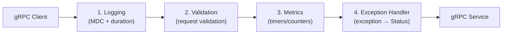

# gRPC Rules

## Proto Style Guide

- Use `snake_case` for field names and file names.
- Use `PascalCase` for message and service names.
- Use `UPPER_SNAKE_CASE` for enum values with a `_UNSPECIFIED = 0` sentinel.
- Package naming: `<organization>.<service>.v<major>` (e.g., `myservice.v1`).
- One service per `.proto` file; shared messages may live in a separate file.
- Add comments on every service, RPC, message, and field.

## Error Handling & Status Codes

- Map domain exceptions to appropriate gRPC status codes:
  - `NOT_FOUND` — Resource does not exist.
  - `INVALID_ARGUMENT` — Client sent malformed or invalid input.
  - `ALREADY_EXISTS` — Conflict with existing resource.
  - `PERMISSION_DENIED` — Caller lacks authorization.
  - `RESOURCE_EXHAUSTED` — Quota exceeded, rate limited.
  - `INTERNAL` — Unexpected server error (do not expose internal details).
  - `UNAVAILABLE` — Transient failure, client may retry.
  - `DEADLINE_EXCEEDED` — Operation took too long.
- Never expose stack traces or internal implementation details in status descriptions.
- Use a global exception-handling interceptor to centralize error translation.

## Streaming Best Practices

- **Client streaming** — Validate the first message (metadata/header) before accepting chunks.
- **Server streaming** — Send metadata in the first response message, then data chunks.
- **Flow control** — Respect backpressure; do not buffer unbounded data in memory.
- **Chunk size** — Use consistent chunk sizes (default 64 KB) defined in configuration.
- **Cancellation** — Handle `onCancel` to release resources when clients disconnect.

## Interceptors

- Use `ServerInterceptor` for cross-cutting concerns (logging, metrics, validation, auth).
- Order interceptors explicitly (e.g., logging → validation → metrics → exception handling).
- Keep interceptors stateless and thread-safe.
- Use MDC for request-scoped context propagation through the call lifecycle.

## Request Validation

- Validate all required fields at the gRPC layer before reaching service logic.
- Return `INVALID_ARGUMENT` with a clear description for validation failures.
- Use guard clauses in the service implementation for business rule validation.

## Health Checks

- Implement `grpc.health.v1.Health` service for load balancer integration.
- Health check must verify downstream dependencies (database, storage).
- Return `SERVING`, `NOT_SERVING`, or `UNKNOWN` based on actual system state.

## Reflection & Documentation

- Enable gRPC reflection in non-production environments for debugging with `grpcurl`.
- Disable reflection in production unless explicitly required.