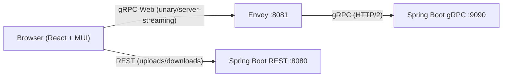
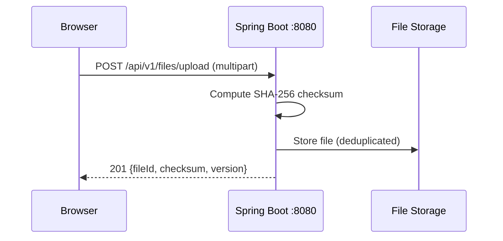

# gRPC File Store

A file storage service with a gRPC backend and a Material UI web frontend.

## Project Structure

```
grpc-file-store/
├── [backend/](./backend/)       # Spring Boot gRPC service (Java 21, Gradle)
├── [frontend/](./frontend/)     # React + MUI + gRPC-Web frontend (Vite, TypeScript)
├── [envoy/](./envoy/)           # Envoy proxy config (gRPC-Web → gRPC translation)
├── docker-compose.yml  # Local dev orchestration
├── buf.yaml       # Protobuf module definition
└── buf.gen.yaml   # TypeScript code generation config
```

## Quick Start

### Prerequisites

- **Java 21** (Corretto, Temurin, or any OpenJDK)
- **Node.js 18+** and **pnpm** (`npm install -g pnpm`)
- **Docker** (for Envoy proxy)

### 1. Start the Backend

```bash
cd backend
./gradlew bootRun
```

Backend starts on:
- **gRPC**: `localhost:9090`
- **REST API**: `localhost:8080` (uploads/downloads)
- **H2 Console**: `localhost:8080/h2-console`

> [!WARNING]
> The H2 database is in-memory only. All data is lost when the backend restarts.

### 2. Start Envoy Proxy

```bash
docker compose up envoy
```

Envoy starts on `localhost:8081`, translating gRPC-Web → gRPC.

### 3. Start the Frontend

```bash
cd frontend
pnpm install
pnpm dev
```

Frontend dev server starts on `http://localhost:5173`.

## Architecture



### Why the Hybrid Approach?

gRPC-Web does not support **client-streaming** RPCs. Since file upload requires client-streaming, the frontend uses:
- **gRPC-Web** (via Envoy) for 9 unary/server-streaming RPCs
- **REST endpoints** on the existing backend for uploads and downloads

> [!IMPORTANT]
> The `UploadFile` and `ResumeUpload` RPCs use client-streaming which is not supported by gRPC-Web.
> These operations use REST endpoints instead (`/api/v1/files/upload`).

## Frontend

| Tech | Purpose |
|------|---------|
| React 19 | UI framework |
| MUI v6 | Component library (Material Design, blue theme) |
| MUI X DataGrid | File listing with columns, sorting |
| TanStack Query | Server state management, caching, pagination |
| Connect-ES v2 | Type-safe gRPC-Web client from proto stubs |
| react-dropzone | Drag-and-drop file upload |
| React Router v7 | SPA routing |
| Vite | Build tool & dev server |
| pnpm | Package manager |

### Pages

- **File Browser** (`/`) — Search, paginated file list, row actions (download, copy, move, delete)
- **Upload** (`/upload`) — Drag-drop zone, progress bar, simple & resumable upload modes

### Regenerating Proto Stubs

> [!NOTE]
> This requires the buf CLI to be installed. Install it from [https://buf.build/docs/installation](https://buf.build/docs/installation).

```bash
cd frontend
pnpm generate
```

## Backend REST API (for Frontend)



| Endpoint | Method | Purpose |
|----------|--------|---------|
| `/api/v1/files/upload` | POST | Multipart file upload |
| `/api/v1/files/upload/initiate` | POST | Start resumable session |
| `/api/v1/files/upload/{sessionId}/resume` | POST | Resume upload (chunked) |
| `/api/v1/files/{fileId}/download?version=0` | GET | Download file (save-as) |

## gRPC API (via gRPC-Web)

| RPC | Type | Used By |
|-----|------|---------|
| `ListFiles` | Unary | File Browser page |
| `GetFileMetadata` | Unary | File detail drawer |
| `GetFileVersions` | Unary | Version history table |
| `DeleteFile` | Unary | Delete dialog |
| `CopyFile` | Unary | Copy dialog |
| `MoveFile` | Unary | Move/Rename dialog |
| `GetUploadStatus` | Unary | Upload progress polling |
| `InitiateResumableUpload` | Unary | (Available via gRPC-Web, but REST used for consistency) |
| `DownloadFile` | Server streaming | (Available, but REST used for save-as UX) |
| `UploadFile` | Client streaming | ❌ Not supported by gRPC-Web → uses REST |
| `ResumeUpload` | Client streaming | ❌ Not supported by gRPC-Web → uses REST |

## Configuration

### Envoy

- Config: [`envoy/envoy.yaml`](./envoy/envoy.yaml)
- Listens: `localhost:8081` (gRPC-Web proxy)
- Admin: `localhost:9901`
- Upstream: `host.docker.internal:9090` (gRPC server)

### Frontend Dev Server

- Port: `5173`
- Proxies `/api/*` to `localhost:8080` (backend REST)
- gRPC-Web calls go directly to `localhost:8081` (Envoy)

### Backend CORS

Configured in `application.yml`:
```yaml
filestore:
  cors:
    allowed-origins:
      - http://localhost:5173
```

## Development

### Run Everything

<details>
<summary>Multi-terminal setup commands</summary>

```bash
# Terminal 1: Backend
cd backend && ./gradlew bootRun

# Terminal 2: Envoy
docker compose up envoy

# Terminal 3: Frontend
cd frontend && pnpm dev
```

</details>

> [!TIP]
> Use `./scripts/start-all.sh` to build and run everything in Docker with a single command.
> The frontend is served from Spring Boot at `http://localhost:8080`.

### Backend Tests

```bash
cd backend
./gradlew test        # 47 tests
./gradlew format      # Auto-format code
```

See [backend/README.md](./backend/README.md) and [backend/PROJECT.md](./backend/PROJECT.md) for more details.

### Frontend Build

```bash
cd frontend
pnpm build            # Production build
pnpm preview          # Preview production build
```

## License

Private — internal project.
