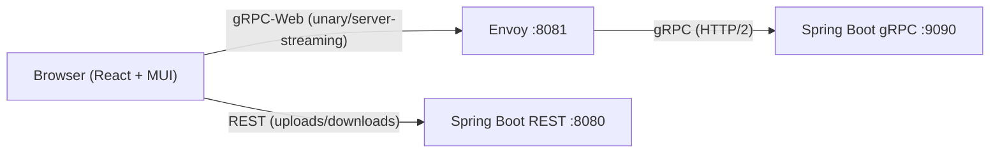
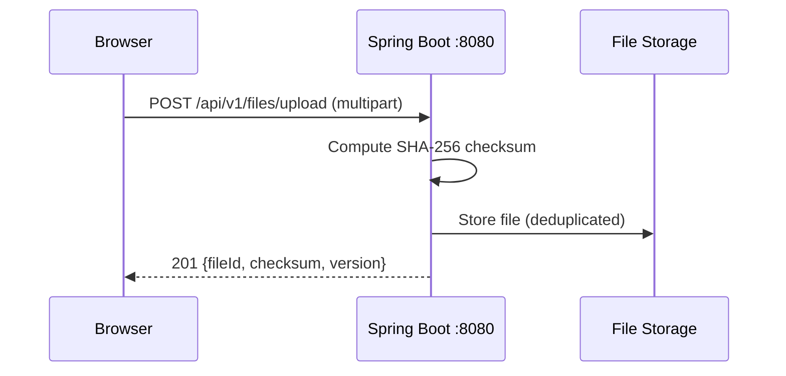

# gRPC File Store

A file storage service with a gRPC backend and a Material UI web frontend.

## Project Structure

```
grpc-file-store/
├── [backend/](./backend/)       # Spring Boot gRPC service (Java 21, Gradle)
├── [frontend/](./frontend/)     # React + MUI + gRPC-Web frontend (Vite, TypeScript)
├── [envoy/](./envoy/)           # Envoy proxy config (gRPC-Web → gRPC translation)
├── [scripts/](./scripts/)       # Start/stop/restart helper scripts (Docker Compose)
├── Dockerfile          # Multi-stage build (frontend build → backend runtime image)
├── docker-compose.yml  # Local dev orchestration (app + envoy)
├── buf.yaml       # Protobuf module definition
└── buf.gen.yaml   # TypeScript code generation config
```

## Quick Start

### Prerequisites

- **Java 21** (Corretto, Temurin, or any OpenJDK)
- **Node.js 18+** and **pnpm** (`npm install -g pnpm`)
- **Docker** (for Envoy proxy)

### 1. Start the Backend

```bash
cd backend
./gradlew bootRun
```

Backend starts on:
- **gRPC**: `localhost:9090`
- **REST API**: `localhost:8080` (uploads/downloads)
- **H2 Console**: `localhost:8080/h2-console`

> [!WARNING]
> The H2 database is in-memory only. All data is lost when the backend restarts.

### 2. Start Envoy Proxy

```bash
docker compose up envoy
```

Envoy starts on `localhost:8081`, translating gRPC-Web → gRPC.

### 3. Start the Frontend

```bash
cd frontend
pnpm install
pnpm dev
```

Frontend dev server starts on `http://localhost:5173`.

## Architecture



### Why the Hybrid Approach?

gRPC-Web does not support **client-streaming** RPCs. Since file upload requires client-streaming, the frontend uses:
- **gRPC-Web** (via Envoy) for 9 unary/server-streaming RPCs
- **REST endpoints** on the existing backend for uploads and downloads

> [!IMPORTANT]
> The `UploadFile` and `ResumeUpload` RPCs use client-streaming which is not supported by gRPC-Web.
> These operations use REST endpoints instead (`/api/v1/files/upload`).

## Frontend

| Tech | Purpose |
|------|---------|
| React 19 | UI framework |
| MUI v6 | Component library (Corona-inspired dark admin theme, Rubik font) |
| MUI X DataGrid | File listing with columns, sorting |
| MUI X Charts / Tree View / Date Pickers | Dashboard template visualizations (v7) |
| TanStack Query | Server state management, caching, pagination |
| Connect-ES v2 | Type-safe gRPC-Web client from proto stubs |
| react-dropzone | Drag-and-drop file upload |
| React Router v7 | SPA routing |
| Vite | Build tool & dev server |
| pnpm | Package manager |

### Pages

- **File Browser** (`/`) — Search, paginated file list, row actions (download, copy, move, delete)
- **Upload** (`/upload`) — Drag-drop zone, progress bar, simple & resumable upload modes
- **Dashboard** (`/dashboard`) — MUI's free [Dashboard template](https://mui.com/material-ui/getting-started/templates/dashboard/) (charts, stat cards, data grid, tree view). Renders as a standalone page with its own theme and shell.

### Dashboard Template

The dashboard page is the official MUI **free** Dashboard template, vendored into
[`src/dashboard-template/`](./frontend/src/dashboard-template/) (`dashboard/` + `shared-theme/`).

> [!NOTE]
> The template was copied from the `v6.4.0` git tag of `mui/material-ui` to match this project's
> `@mui/material` v6 line — the `master` template targets Material UI v7 (unified `Grid`, `theme.vars`
> on the base `Theme`) and will not compile against v6.

Local adaptations applied to make it build under the project's strict `tsconfig`:

- Enabled the `CssThemeVariables` module augmentation in
  [`theme-augmentation.d.ts`](./frontend/src/dashboard-template/theme-augmentation.d.ts) so `theme.vars` types resolve.
- Removed `@mui/x-data-grid-pro` / `@mui/x-date-pickers-pro` type-only augmentation imports (Pro packages are not used).
- Stripped unused `React` namespace imports (`noUnusedLocals`).

It brings in these pinned dependencies: `@mui/x-charts`, `@mui/x-tree-view`, `@mui/x-date-pickers`
(all v7, matching `@mui/x-data-grid`), plus `dayjs`, `clsx`, and `@react-spring/web`.

### Regenerating Proto Stubs

> [!NOTE]
> This requires the buf CLI to be installed. Install it from [https://buf.build/docs/installation](https://buf.build/docs/installation).

```bash
cd frontend
pnpm generate
```

This regenerates the TypeScript client stubs (`src/generated/`) and the HTML API reference
(`public/grpc-docs.html`, via the `protoc-gen-doc` buf plugin).

## Backend REST API (for Frontend)



| Endpoint | Method | Purpose |
|----------|--------|---------|
| `/api/v1/files/upload` | POST | Multipart file upload |
| `/api/v1/files/upload/initiate` | POST | Start resumable session |
| `/api/v1/files/upload/{sessionId}/resume` | POST | Resume upload (chunked) |
| `/api/v1/files/{fileId}/download?version=0` | GET | Download file (save-as) |

> [!TIP]
> Interactive **Swagger UI** for these REST endpoints (via springdoc-openapi) is served at
> [`/swagger-ui.html`](http://localhost:8080/swagger-ui.html); the raw OpenAPI spec is at
> [`/v3/api-docs`](http://localhost:8080/v3/api-docs). Both URLs are printed in the startup banner.

## gRPC API (via gRPC-Web)

| RPC | Type | Used By |
|-----|------|---------|
| `ListFiles` | Unary | File Browser page |
| `GetFileMetadata` | Unary | File detail drawer |
| `GetFileVersions` | Unary | Version history table |
| `DeleteFile` | Unary | Delete dialog |
| `CopyFile` | Unary | Copy dialog |
| `MoveFile` | Unary | Move/Rename dialog |
| `GetUploadStatus` | Unary | Upload progress polling |
| `InitiateResumableUpload` | Unary | (Available via gRPC-Web, but REST used for consistency) |
| `DownloadFile` | Server streaming | (Available, but REST used for save-as UX) |
| `UploadFile` | Client streaming | ❌ Not supported by gRPC-Web → uses REST |
| `ResumeUpload` | Client streaming | ❌ Not supported by gRPC-Web → uses REST |

## gRPC API Documentation

The `.proto` file is the source of truth; there are two ways to explore the API:

- **Static HTML reference** — generated from the proto via buf + `protoc-gen-doc` and served by the
  app at [`/grpc-docs.html`](http://localhost:8080/grpc-docs.html). The URL is printed in the backend
  startup banner. It is (re)generated by `pnpm generate` alongside the TypeScript stubs.
- **Interactive UI (dev)** — run [`./scripts/grpc-ui.sh`](./scripts/grpc-ui.sh) to launch
  [grpcui](https://github.com/fullstorydev/grpcui), a Swagger-UI-like web client backed by gRPC
  server reflection, at `http://localhost:8082`.

> [!IMPORTANT]
> grpcui relies on gRPC reflection, which is enabled only in the dev/local profile and must stay
> disabled in production. Use the static HTML reference for published docs.

## Service-to-Service Integration (gRPC stubs)

Other JVM services integrate over gRPC by depending on a published **stubs** artifact instead of
copying the `.proto`. The [`backend/stubs`](./backend/stubs/) Gradle module generates the Java
Protobuf + gRPC stubs and publishes them as `com.example:grpc-file-store-stubs`.

Publish to your local Maven repo (`~/.m2`):

```bash
./scripts/publish-stubs.sh
# equivalent to: cd backend && ./gradlew :stubs:publishToMavenLocal
```

Consume from another Gradle service:

```kotlin
repositories { mavenLocal() } // or a shared Nexus/Artifactory/GitHub Packages repo

dependencies {
    implementation("com.example:grpc-file-store-stubs:0.0.1-SNAPSHOT")
}
```

```java
var channel = ManagedChannelBuilder.forAddress("localhost", 9090).usePlaintext().build();
var stub = FileStoreServiceGrpc.newBlockingStub(channel);
var files = stub.listFiles(ListFilesRequest.newBuilder().setPageSize(10).build());
```

> [!NOTE]
> The default publish target is `mavenLocal` for zero-setup local integration. Point the `publishing`
> repository in [`backend/stubs/build.gradle.kts`](./backend/stubs/build.gradle.kts) at a shared
> Maven repository for cross-team consumption. The stubs jar also bundles the `.proto` (under
> `proto/`) so non-JVM consumers can regenerate their own clients.

## Configuration

### Envoy

- Config: [`envoy/envoy.yaml`](./envoy/envoy.yaml)
- Listens: `localhost:8081` (gRPC-Web proxy)
- Admin: `localhost:9901`
- Upstream: `host.docker.internal:9090` (gRPC server)

### Frontend Dev Server

- Port: `5173`
- Proxies `/api/*` to `localhost:8080` (backend REST)
- gRPC-Web calls go directly to `localhost:8081` (Envoy)

### Backend CORS

Configured in `application.yml`:
```yaml
filestore:
  cors:
    allowed-origins:
      - http://localhost:5173
```

## Development

### Run Everything

<details>
<summary>Multi-terminal setup commands</summary>

```bash
# Terminal 1: Backend
cd backend && ./gradlew bootRun

# Terminal 2: Envoy
docker compose up envoy

# Terminal 3: Frontend
cd frontend && pnpm dev
```

</details>

> [!TIP]
> Use `./scripts/start-all.sh` to build and run everything in Docker with a single command.
> The frontend is served from Spring Boot at `http://localhost:8080`.

Helper scripts in [`scripts/`](./scripts/):

| Script | Purpose |
|--------|---------|
| `start-all.sh` | Build and start the full stack (app + Envoy) in Docker |
| `restart-all.sh` | Rebuild and restart the full stack |
| `stop-all.sh` | Stop and remove the Docker Compose stack |
| `start-backend.sh` | Start the backend only (`./gradlew bootRun`) |
| `start-frontend.sh` | Start the frontend dev server only |
| `start-envoy.sh` | Start the Envoy proxy only |
| `grpc-ui.sh` | Launch grpcui — interactive gRPC web UI (needs the backend running) |
| `publish-stubs.sh` | Publish the gRPC stubs artifact to the local Maven repo (`~/.m2`) |

### Backend Tests

```bash
cd backend
./gradlew test        # 47 tests
./gradlew format      # Auto-format code
```

See [backend/README.md](./backend/README.md) and [backend/PROJECT.md](./backend/PROJECT.md) for more details.

### Frontend Build

```bash
cd frontend
pnpm build            # Production build
pnpm preview          # Preview production build
```

## License

Private — internal project.
