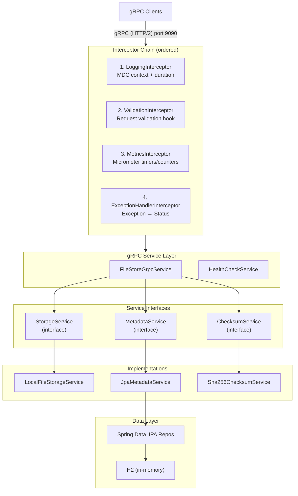

# PROJECT.md — gRPC File Store

## Technology Stack

| Layer | Technology | Version |
|-------|-----------|---------|
| Language | Java | 21 |
| Framework | Spring Boot | 3.5.16 |
| Build | Gradle (Kotlin DSL) | 9.6.0 |
| gRPC | grpc-spring-boot-starter (net.devh) | 3.1.0.RELEASE |
| Protobuf | proto3 | 4.35.1 |
| gRPC Core | io.grpc | 1.78.0 |
| Database | H2 (in-memory) | Spring Boot managed |
| ORM | Spring Data JPA / Hibernate | Spring Boot managed |
| Mapping | MapStruct | 1.6.3 |
| Metrics | Micrometer | Spring Boot managed |
| Logging | SLF4J + Logback + Logstash Encoder | 8.0 |
| Lombok | Lombok | Spring Boot managed |
| Formatting | Spotless | 8.4.0 |

## Architecture



## Design Principles

### SOLID

- **ISP** — Three focused service interfaces: `StorageService`, `MetadataService`, `ChecksumService`.
- **DIP** — gRPC service depends only on interfaces, never concrete implementations.
- **OCP** — New storage backends added via `@ConditionalOnProperty` without modifying existing code.
- **SRP** — Each class has a single responsibility (lock management, upload tracking, checksum computation, etc.).

### Patterns

| Pattern | Usage |
|---------|-------|
| Strategy | Pluggable storage backends via config (`LOCAL`, `S3`, `GCS`) |
| Observer | Spring `ApplicationEvent` for file lifecycle (upload/delete) |
| Guard Clause | Early-return pattern with `orElseThrow()` in all RPC handlers |
| Builder | Proto message construction via generated builders + MapStruct |
| Interceptor Chain | Ordered gRPC interceptors for cross-cutting concerns |

### Concurrency

| Resource | Mechanism |
|----------|-----------|
| gRPC requests | Virtual threads (Project Loom) |
| File read/write | `ReadWriteLock` per file via `FileLockManager` |
| File-record creation | Striped lock keyed by filename (`FilenameLockManager`) — prevents duplicate file records |
| Dedup vs. reclamation | Striped lock keyed by checksum (`ChecksumLockManager`) — shared by upload dedup and storage reclamation |
| Upload tracking | `ConcurrentHashMap` in `UploadTracker` |
| Version counter | `@Transactional(isolation = SERIALIZABLE)` |
| Checksum digest | Thread-local per upload stream (no sharing) |
| Upload buffering | Temp file on disk (constant memory regardless of file size) |
| Quota calculation | Single aggregate SQL query (`SUM(size)`) — O(1) memory |

### Observability

| Concern | Implementation |
|---------|---------------|
| Request logging | `LoggingInterceptor` with MDC context (12 fields) |
| Structured JSON | `LogstashEncoder` in `prod` profile |
| Console logging | Pattern-based in `dev` profile with MDC fields |
| Log rotation | Daily, 30-day retention, 1 GB max |
| Metrics | Micrometer `grpc.server.requests.duration` + `.count` (by method, status) |
| Health (gRPC) | `grpc.health.v1.Health/Check` → SERVING |
| Health (HTTP) | `/actuator/health` with custom indicators (storage, database) |
| Heartbeat | Scheduled log every 5 min (configurable) with MDC context |

### MDC Fields

| Key | Set By | Description |
|-----|--------|-------------|
| `request-id` | Interceptor | UUID per RPC call |
| `method` | Interceptor | gRPC method name |
| `client-ip` | Interceptor | Remote address |
| `user-agent` | Interceptor | Client user-agent header |
| `status` | Interceptor | gRPC status code at completion |
| `duration-ms` | Interceptor | Request duration in milliseconds |
| `file-id` | Service | File UUID being operated on |
| `filename` | Service | Original filename |
| `content-type` | Service | MIME type (upload) |
| `version` | Service | File version accessed/created |
| `session-id` | Service | Upload session identifier |
| `bytes-transferred` | Service | Total bytes uploaded/downloaded |

## Error Handling

Exceptions are mapped to gRPC status codes via `ExceptionHandlerInterceptor`:

| Exception | gRPC Status |
|-----------|-------------|
| `FileNotFoundException` | `NOT_FOUND` |
| `StorageQuotaExceededException` | `RESOURCE_EXHAUSTED` |
| `IllegalArgumentException` | `INVALID_ARGUMENT` |
| `UncheckedIOException` | `INTERNAL` |
| Any other `RuntimeException` | `INTERNAL` |

## Data Model

### FileEntity

| Column | Type | Notes |
|--------|------|-------|
| `id` | UUID (PK) | Auto-generated |
| `filename` | VARCHAR(512) | Original filename |
| `content_type` | VARCHAR(255) | MIME type |
| `current_version` | INT | Latest version number |
| `created_at` | TIMESTAMP | First upload time |
| `updated_at` | TIMESTAMP | Last modification |
| `deleted` | BOOLEAN | Soft-delete flag |

### FileVersionEntity

| Column | Type | Notes |
|--------|------|-------|
| `id` | UUID (PK) | Auto-generated |
| `file_id` | UUID (FK) | References FileEntity |
| `version` | INT | Version number |
| `storage_path` | VARCHAR(1024) | Path on disk |
| `size` | BIGINT | File size in bytes |
| `checksum` | VARCHAR(64) | SHA-256 hex digest |
| `created_at` | TIMESTAMP | Upload time for this version |

## Filesystem Layout

```
./file-store-data/
  └── {file-id}/
      ├── v1_{filename}.dat
      ├── v2_{filename}.dat
      └── v3_{filename}.dat
```

## Current State

- [x] Proto definition with 11 RPCs + health check
- [x] Client-streaming upload with incremental SHA-256
- [x] Server-streaming download with chunked response
- [x] Resumable uploads (initiate session, resume from offset, status check)
- [x] File copy/move (server-side zero-copy and rename)
- [x] Content-addressable deduplication (SHA-256 checksum reuse)
- [x] Reference-counted storage reclamation (physical delete when no active version references a path)
- [x] Global storage quota management (RESOURCE_EXHAUSTED when exceeded)
- [x] TTL auto-expiry (scheduled cleanup of files exceeding retention period)
- [x] Paginated search (case-insensitive filename LIKE)
- [x] Soft-delete with event publishing
- [x] Version history
- [x] gRPC interceptor chain (logging, validation, metrics, exception handling)
- [x] MDC context with 12 fields
- [x] Virtual threads enabled
- [x] Per-file ReadWriteLock concurrency
- [x] gRPC reflection enabled
- [x] Dual health endpoints (gRPC + Actuator)
- [x] Periodic heartbeat logging (configurable interval)
- [x] Structured JSON logging (prod profile)
- [x] Spotless code formatting (import order, whitespace, newlines)
- [x] Test coverage > 91% (47 tests: 20 integration + 27 unit)
- [x] Guard clause pattern throughout
- [x] JaCoCo coverage reporting
