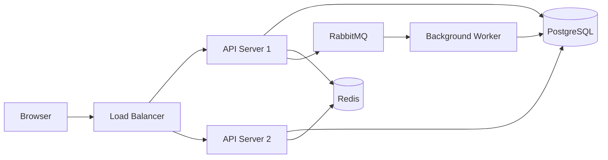
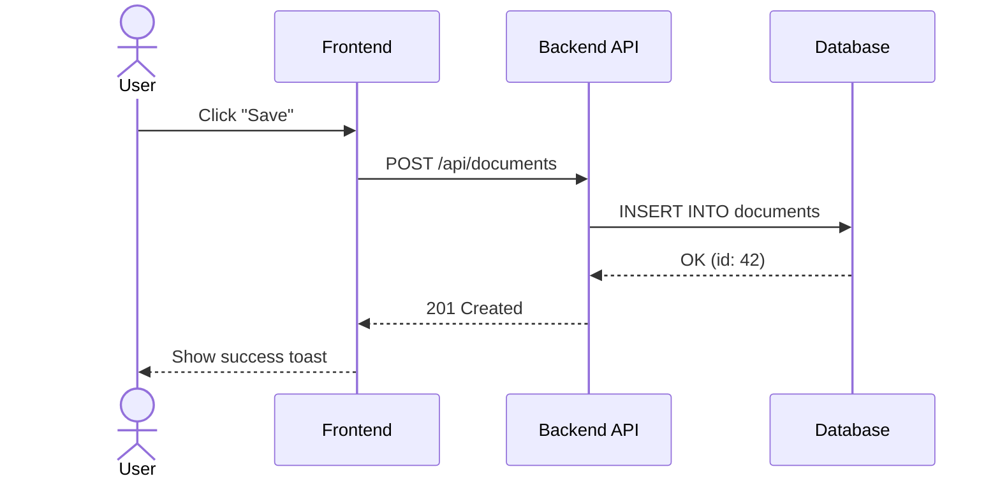

# GitHub Markdown — Complete Reference

A comprehensive guide to **all** markdown features supported by GitHub, with examples.

---

## Text Formatting

This is **bold text** and this is *italic text*.

This is ***bold and italic*** together.

This is ~~strikethrough~~ text.

This is `inline code` within a sentence.

This is a <sub>subscript</sub> and this is a <sup>superscript</sup>.

---

## Headings

# Heading 1
## Heading 2
### Heading 3
#### Heading 4
##### Heading 5
###### Heading 6

---

## Links

### Standard Links
[GitHub Home](https://github.com)

[Link with title](https://github.com "Visit GitHub")

### Autolinks
https://github.com

### Reference-Style Links
[Spring Boot Documentation][spring-docs]

[Kotlin Language][kotlin]

[spring-docs]: https://docs.spring.io/spring-boot/docs/current/reference/html/
[kotlin]: https://kotlinlang.org/

---

## Images

### Inline Image


### Image with Link
[](https://github.com)

### Sized Image (HTML)


---

## Lists

### Unordered Lists
- Item one
- Item two
  - Nested item A
  - Nested item B
    - Deep nested
- Item three

### Ordered Lists
1. First step
2. Second step
   1. Sub-step A
   2. Sub-step B
3. Third step

### Mixed Lists
1. Install dependencies
   - Node.js 18+
   - npm or yarn
2. Configure environment
   - Copy `.env.example` to `.env`
   - Update database credentials
3. Run the application

### Task Lists
- [x] Design database schema
- [x] Implement REST API
- [ ] Write integration tests
- [ ] Deploy to staging
- [ ] Get QA sign-off

---

## Blockquotes

> Simple blockquote with a single paragraph.

> Multi-line blockquote.
>
> Second paragraph within the same blockquote.
> This continues the same block.

> Nested blockquotes:
>
> > This is a nested blockquote.
> >
> > > And this is even deeper.

> **Blockquote with formatting:**
>
> You can use *italic*, **bold**, `code`, and [links](https://example.com) inside blockquotes.
>
> - Even lists work
> - Inside blockquotes

---

## Code

### Inline Code
Use `System.out.println()` for debugging (but don't commit it).

### Fenced Code Blocks

```java
public record UserResponse(
    String id,
    String name,
    String email,
    Instant createdAt
) {
    public static UserResponse from(User user) {
        return new UserResponse(
            user.getId().toString(),
            user.getName(),
            user.getEmail(),
            user.getCreatedAt()
        );
    }
}
```

```python
def fibonacci(n: int) -> list[int]:
    """Generate Fibonacci sequence up to n terms."""
    if n <= 0:
        return []
    sequence = [0, 1]
    while len(sequence) < n:
        sequence.append(sequence[-1] + sequence[-2])
    return sequence[:n]
```

```bash
#!/bin/bash
set -euo pipefail

echo "Building project..."
./gradlew clean build -x test

echo "Running tests..."
./gradlew test --info

echo "Build complete!"
```

```sql
SELECT u.name, COUNT(o.id) AS order_count, SUM(o.total) AS total_spent
FROM users u
LEFT JOIN orders o ON o.user_id = u.id
WHERE u.created_at >= '2026-01-01'
GROUP BY u.name
HAVING COUNT(o.id) > 5
ORDER BY total_spent DESC
LIMIT 20;
```

```yaml
services:
  app:
    build: .
    ports:
      - "8080:8080"
    environment:
      - SPRING_PROFILES_ACTIVE=docker
      - DATABASE_URL=jdbc:postgresql://db:5432/myapp
    depends_on:
      db:
        condition: service_healthy

  db:
    image: postgres:16-alpine
    environment:
      POSTGRES_DB: myapp
      POSTGRES_PASSWORD: secret
    healthcheck:
      test: ["CMD-SHELL", "pg_isready -U postgres"]
      interval: 5s
```

```diff
- private final ExecutorService executor = Executors.newFixedThreadPool(10);
+ private final ExecutorService executor = Executors.newVirtualThreadPerTaskExecutor();

- public void processItems(List<Item> items) {
-     for (Item item : items) {
-         processItem(item);
-     }
- }
+ public void processItems(List<Item> items) {
+     items.parallelStream()
+         .forEach(this::processItem);
+ }
```

### Syntax Highlighting Languages Supported
GitHub supports hundreds of languages including: `java`, `kotlin`, `python`, `javascript`, `typescript`, `go`, `rust`, `c`, `cpp`, `csharp`, `ruby`, `swift`, `bash`, `sql`, `yaml`, `json`, `xml`, `html`, `css`, `dockerfile`, `terraform`, `groovy`, `scala`, `haskell`, and many more.

---

## Tables

### Basic Table
| Method | Endpoint | Description |
|--------|----------|-------------|
| GET | `/api/users` | List all users |
| POST | `/api/users` | Create a user |
| GET | `/api/users/:id` | Get user by ID |
| PUT | `/api/users/:id` | Update a user |
| DELETE | `/api/users/:id` | Delete a user |

### Aligned Table
| Property | Type | Default | Description |
|:---------|:----:|--------:|:------------|
| `host` | string | `localhost` | Server hostname |
| `port` | int | `8080` | Server port |
| `timeout` | int | `30000` | Request timeout (ms) |
| `maxRetries` | int | `3` | Maximum retry attempts |
| `debug` | boolean | `false` | Enable debug logging |

### Table with Formatting
| Status | Badge | Meaning |
|--------|-------|---------|
| ✅ Passing | `200 OK` | All checks passed |
| ⚠️ Warning | `429 Too Many` | Rate limited |
| ❌ Failed | `500 Error` | Server failure |
| 🔄 Pending | `202 Accepted` | Processing async |
| 🚫 Blocked | `403 Forbidden` | Access denied |

---

## Horizontal Rules

Three or more hyphens:

---

Three or more asterisks:

***

Three or more underscores:

___

---

## Escaping Characters

Use backslash to escape special characters:

\*This is not italic\*

\# This is not a heading

\- This is not a list item

\[This is not a link\](https://example.com)

Literal backtick: \`code\`

---

## HTML Elements (Supported Subset)

### Line Break
First line<br>Second line (without a paragraph break)

### Keyboard Keys
Press <kbd>Ctrl</kbd> + <kbd>Shift</kbd> + <kbd>P</kbd> to open the command palette.

Use <kbd>⌘</kbd> + <kbd>K</kbd> on macOS.

### Definition Lists (via HTML)
<dl>
  <dt>SRP</dt>
  <dd>Single Responsibility Principle — a class should have only one reason to change.</dd>

  <dt>OCP</dt>
  <dd>Open/Closed Principle — open for extension, closed for modification.</dd>

  <dt>DIP</dt>
  <dd>Dependency Inversion Principle — depend on abstractions, not concretions.</dd>
</dl>

### Centered Text
<p align="center">
  <strong>Centered and bold text</strong><br>
  With a second line underneath
</p>

### Colored Text (via image badges workaround)


---

## Alerts / Callouts

> [!NOTE]
> Useful information that users should know, even when skimming content.

> [!TIP]
> Helpful advice for doing things better or more easily.

> [!IMPORTANT]
> Key information users need to know to achieve their goal.

> [!WARNING]
> Urgent info that needs immediate user attention to avoid problems.

> [!CAUTION]
> Advises about risks or negative outcomes of certain actions.

---

## Mermaid Diagrams

### Architecture Diagram


### Sequence Diagram


---

## Math (LaTeX)

### Inline
The Big-O complexity is $O(n \log n)$ for merge sort.

### Block
```math
\text{throughput} = \frac{\text{requests completed}}{\text{elapsed time (seconds)}}
```

---

## Footnotes

Kubernetes uses etcd as its backing store[^1]. The API server is stateless[^2].

[^1]: etcd is a distributed key-value store that provides a reliable way to store data across a cluster.
[^2]: This means you can run multiple API server instances for high availability.

---

## Collapsed Sections

<details>
<summary><strong>📋 Full API Response Example</strong></summary>

```json
{
  "id": "550e8400-e29b-41d4-a716-446655440000",
  "name": "John Doe",
  "email": "john@example.com",
  "roles": ["admin", "user"],
  "metadata": {
    "lastLogin": "2026-07-09T10:30:00Z",
    "loginCount": 142
  }
}
```

</details>

<details>
<summary><strong>🔧 Troubleshooting Steps</strong></summary>

1. Check if the service is running: `systemctl status myapp`
2. Review logs: `journalctl -u myapp -f`
3. Verify database connectivity: `pg_isready -h localhost`
4. Check disk space: `df -h`
5. Restart if needed: `systemctl restart myapp`

</details>

---

## Emoji

### Common Emoji Shortcodes
| Shortcode | Emoji | Use |
|-----------|-------|-----|
| `:white_check_mark:` | ✅ | Done / Passing |
| `:x:` | ❌ | Failed / Blocked |
| `:warning:` | ⚠️ | Warning |
| `:rocket:` | 🚀 | Deploy / Launch |
| `:bug:` | 🐛 | Bug report |
| `:sparkles:` | ✨ | New feature |
| `:memo:` | 📝 | Documentation |
| `:lock:` | 🔒 | Security |
| `:zap:` | ⚡ | Performance |
| `:wrench:` | 🔧 | Configuration |

---

## Relative Links & Anchors

### Link to Another File
[See the contributing guide](./CONTRIBUTING.md)

### Link to a Section (Anchor)
[Jump to Code section](#code)

[Jump to Tables](#tables)

### Link to a Specific Line in a File
[See line 42 of Main.java](./src/main/java/Main.java#L42)

---

## Badges (via shields.io)


---

## Advanced: Combining Features

### Table with Task Lists and Emoji

| Feature | Status | Owner |
|---------|--------|-------|
| Authentication | ✅ Complete | @backend-team |
| Search API | 🚧 In Progress | @search-team |
| Export PDF | ❌ Not Started | @docs-team |
| Dark Mode | ✅ Complete | @frontend-team |
| Mobile App | 📋 Planned | @mobile-team |

### Blockquote with Code

> **Migration Note:**
>
> After upgrading to v3.0, update your config:
> ```yaml
> # Old format (deprecated)
> database.url: jdbc:postgres://...
>
> # New format (required)
> spring:
>   datasource:
>     url: jdbc:postgresql://...
> ```

### Nested Collapsed Sections

<details>
<summary><strong>Platform Support Matrix</strong></summary>

| Platform | Status | Notes |
|----------|--------|-------|
| Linux x86_64 | ✅ | Primary target |
| Linux ARM64 | ✅ | Docker supported |
| macOS ARM64 | ✅ | M1/M2/M3 native |
| macOS x86_64 | ⚠️ | Rosetta 2 only |
| Windows x64 | ✅ | Requires WSL2 for Docker |

<details>
<summary>Linux Installation Details</summary>

```bash
curl -fsSL https://get.example.com | bash
sudo systemctl enable --now myapp
```

</details>

<details>
<summary>macOS Installation Details</summary>

```bash
brew tap example/tap
brew install myapp
```

</details>

</details>

---

*Last updated: 2026-07-09*
