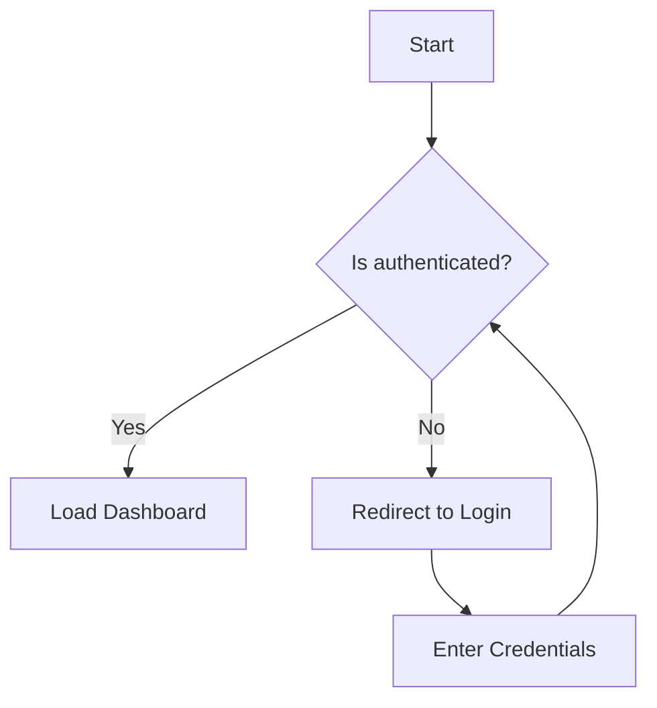
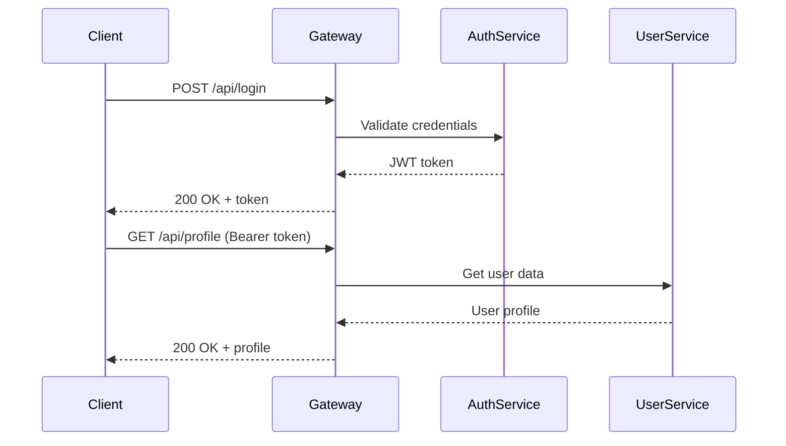
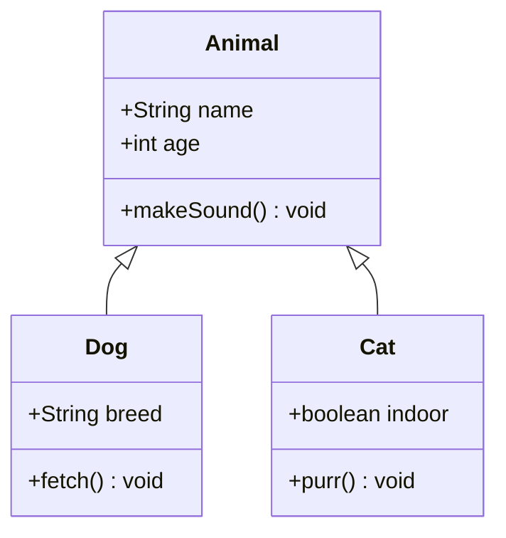
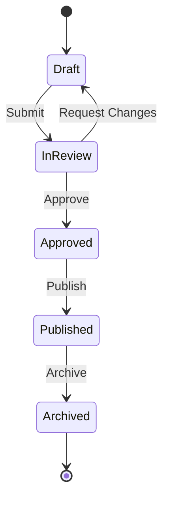
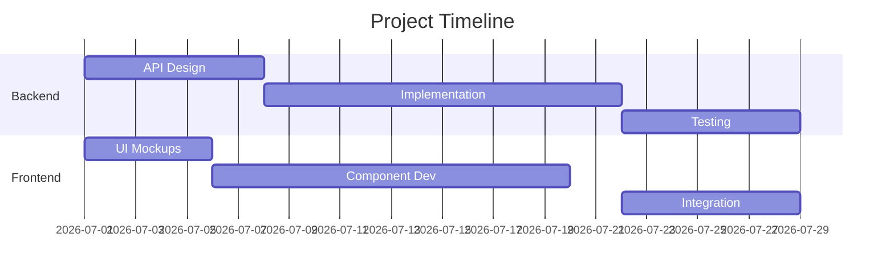
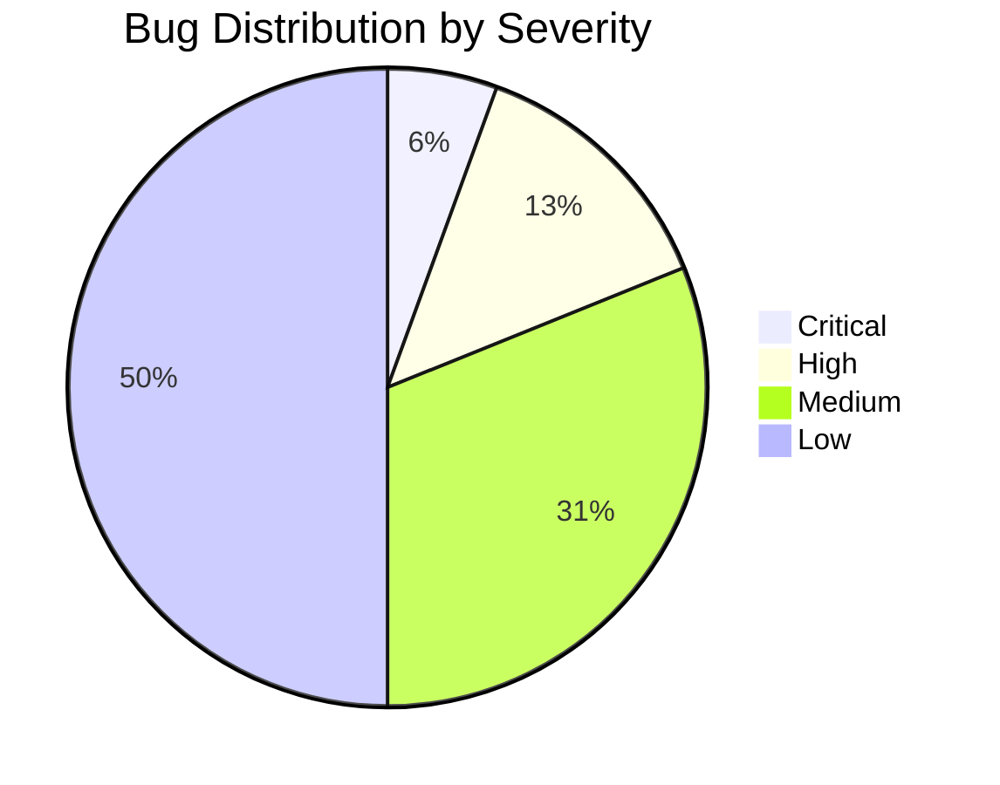

# GitHub-Specific Markdown Features — Examples

A comprehensive reference with at least 5 examples for each GitHub-exclusive markdown feature.

---

## 1. Alerts / Callouts

> [!NOTE]
> This function is deprecated since v3.2. Use `processAsync()` instead.

> [!TIP]
> You can speed up builds by enabling Gradle's build cache: `org.gradle.caching=true`

> [!IMPORTANT]
> All API keys must be rotated before the 2026-08-01 deadline. Failure to do so will result in service interruption.

> [!WARNING]
> Running `./gradlew clean` will delete all build outputs including generated sources. Make sure you don't have unsaved work in `build/generated/`.

> [!CAUTION]
> This operation performs a `DROP TABLE` and is **irreversible**. Always take a backup before running this migration in production.

> [!NOTE]
> The default timeout is 30 seconds. Override with `-Dhttp.timeout=60000` for large file uploads.

> [!TIP]
> Use `Ctrl+Shift+P` (or `Cmd+Shift+P` on macOS) to open the command palette in VS Code.

---

## 2. Mermaid Diagrams

### Flowchart



### Sequence Diagram



### Class Diagram



### State Diagram



### Gantt Chart



### Pie Chart



---

## 3. Math (LaTeX)

### Inline Math

The time complexity of binary search is $O(\log n)$.

Einstein's famous equation: $E = mc^2$

The quadratic formula gives $x = \frac{-b \pm \sqrt{b^2 - 4ac}}{2a}$.

The probability is $P(A|B) = \frac{P(B|A) \cdot P(A)}{P(B)}$.

Standard deviation: $\sigma = \sqrt{\frac{1}{N}\sum_{i=1}^{N}(x_i - \mu)^2}$

### Block Math

```math
\int_{0}^{\infty} e^{-x^2} dx = \frac{\sqrt{\pi}}{2}
```

```math
\begin{bmatrix}
a & b \\
c & d
\end{bmatrix}
\begin{bmatrix}
x \\
y
\end{bmatrix}
=
\begin{bmatrix}
ax + by \\
cx + dy
\end{bmatrix}
```

```math
\sum_{n=1}^{\infty} \frac{1}{n^2} = \frac{\pi^2}{6}
```

```math
\nabla \times \mathbf{E} = -\frac{\partial \mathbf{B}}{\partial t}
```

```math
f(x) = \begin{cases}
  x^2 & \text{if } x \geq 0 \\
  -x^2 & \text{if } x < 0
\end{cases}
```

---

## 4. GeoJSON / TopoJSON

### Simple Point

```geojson
{
  "type": "Feature",
  "geometry": {
    "type": "Point",
    "coordinates": [151.2093, -33.8688]
  },
  "properties": {
    "name": "Sydney Office"
  }
}
```

### Multiple Points

```geojson
{
  "type": "FeatureCollection",
  "features": [
    {
      "type": "Feature",
      "geometry": { "type": "Point", "coordinates": [151.2093, -33.8688] },
      "properties": { "name": "Sydney" }
    },
    {
      "type": "Feature",
      "geometry": { "type": "Point", "coordinates": [144.9631, -37.8136] },
      "properties": { "name": "Melbourne" }
    },
    {
      "type": "Feature",
      "geometry": { "type": "Point", "coordinates": [153.0251, -27.4698] },
      "properties": { "name": "Brisbane" }
    }
  ]
}
```

### Polygon (Area)

```geojson
{
  "type": "Feature",
  "geometry": {
    "type": "Polygon",
    "coordinates": [[
      [151.19, -33.87],
      [151.22, -33.87],
      [151.22, -33.85],
      [151.19, -33.85],
      [151.19, -33.87]
    ]]
  },
  "properties": {
    "name": "Sydney CBD Area"
  }
}
```

### LineString (Route)

```geojson
{
  "type": "Feature",
  "geometry": {
    "type": "LineString",
    "coordinates": [
      [151.2093, -33.8688],
      [150.8931, -34.4248],
      [150.5209, -34.7540],
      [149.1300, -35.2809]
    ]
  },
  "properties": {
    "name": "Sydney to Canberra Route"
  }
}
```

### TopoJSON Example

```topojson
{
  "type": "Topology",
  "objects": {
    "example": {
      "type": "GeometryCollection",
      "geometries": [
        {
          "type": "Point",
          "coordinates": [151.2093, -33.8688],
          "properties": { "name": "Sydney" }
        },
        {
          "type": "Point",
          "coordinates": [-0.1276, 51.5074],
          "properties": { "name": "London" }
        },
        {
          "type": "Point",
          "coordinates": [-74.0060, 40.7128],
          "properties": { "name": "New York" }
        }
      ]
    }
  }
}
```

---

## 5. STL 3D Models

```stl
solid cube
  facet normal 0 0 -1
    outer loop
      vertex 0 0 0
      vertex 1 0 0
      vertex 1 1 0
    endloop
  endfacet
  facet normal 0 0 -1
    outer loop
      vertex 0 0 0
      vertex 1 1 0
      vertex 0 1 0
    endloop
  endfacet
  facet normal 0 0 1
    outer loop
      vertex 0 0 1
      vertex 1 1 1
      vertex 1 0 1
    endloop
  endfacet
  facet normal 0 0 1
    outer loop
      vertex 0 0 1
      vertex 0 1 1
      vertex 1 1 1
    endloop
  endfacet
  facet normal 0 -1 0
    outer loop
      vertex 0 0 0
      vertex 1 0 1
      vertex 1 0 0
    endloop
  endfacet
  facet normal 0 -1 0
    outer loop
      vertex 0 0 0
      vertex 0 0 1
      vertex 1 0 1
    endloop
  endfacet
  facet normal 1 0 0
    outer loop
      vertex 1 0 0
      vertex 1 0 1
      vertex 1 1 1
    endloop
  endfacet
  facet normal 1 0 0
    outer loop
      vertex 1 0 0
      vertex 1 1 1
      vertex 1 1 0
    endloop
  endfacet
  facet normal 0 1 0
    outer loop
      vertex 0 1 0
      vertex 1 1 0
      vertex 1 1 1
    endloop
  endfacet
  facet normal 0 1 0
    outer loop
      vertex 0 1 0
      vertex 1 1 1
      vertex 0 1 1
    endloop
  endfacet
  facet normal -1 0 0
    outer loop
      vertex 0 0 0
      vertex 0 1 0
      vertex 0 1 1
    endloop
  endfacet
  facet normal -1 0 0
    outer loop
      vertex 0 0 0
      vertex 0 1 1
      vertex 0 0 1
    endloop
  endfacet
endsolid cube
```

> [!NOTE]
> STL rendering on GitHub shows an interactive 3D viewer. The above is a simple cube. More complex models (pyramids, spheres approximations, mechanical parts) work the same way but with more facets.

---

## 6. Footnotes

Here's a statement that needs a citation[^1].

The algorithm runs in linear time[^2], which makes it suitable for large datasets[^3].

This design pattern was first described by the Gang of Four[^4].

Kotlin coroutines provide structured concurrency[^5], unlike raw threads.

The JVM uses escape analysis[^6] to determine if objects can be allocated on the stack.

[^1]: Smith, J. (2024). "Modern Software Architecture". O'Reilly Media, p. 42.
[^2]: Assuming the input is already sorted. Worst case is $O(n \log n)$.
[^3]: Benchmarked with 10M records on an M1 MacBook Pro — completes in 1.2 seconds.
[^4]: Gamma, E. et al. (1994). "Design Patterns: Elements of Reusable Object-Oriented Software".
[^5]: See [Kotlin Coroutines Guide](https://kotlinlang.org/docs/coroutines-guide.html) for details.
[^6]: JEP 394: Pattern Matching for instanceof — available since Java 16.

---

## 7. Collapsed Sections

<details>
<summary>Click to see the full stack trace</summary>

```
java.lang.NullPointerException: Cannot invoke "String.length()" because "str" is null
    at com.example.service.UserService.validateName(UserService.java:42)
    at com.example.controller.UserController.createUser(UserController.java:28)
    at sun.reflect.NativeMethodAccessorImpl.invoke0(Native Method)
    at org.springframework.web.servlet.FrameworkServlet.service(FrameworkServlet.java:897)
```

</details>

<details>
<summary>Environment Variables Required</summary>

| Variable | Description | Required |
|----------|-------------|----------|
| `DATABASE_URL` | PostgreSQL connection string | Yes |
| `REDIS_HOST` | Redis cache hostname | Yes |
| `API_KEY` | External service API key | Yes |
| `LOG_LEVEL` | Logging verbosity (DEBUG, INFO, WARN) | No |
| `MAX_POOL_SIZE` | DB connection pool size | No |

</details>

<details>
<summary>Migration SQL Script</summary>

```sql
ALTER TABLE users ADD COLUMN last_login_at TIMESTAMP;
ALTER TABLE users ADD COLUMN login_count INTEGER DEFAULT 0;
CREATE INDEX idx_users_last_login ON users(last_login_at);
UPDATE users SET login_count = 0 WHERE login_count IS NULL;
ALTER TABLE users ALTER COLUMN login_count SET NOT NULL;
```

</details>

<details>
<summary>Performance Benchmark Results</summary>

### Before Optimization
- p50: 120ms
- p95: 450ms
- p99: 1200ms
- Throughput: 500 req/s

### After Optimization
- p50: 15ms
- p95: 45ms
- p99: 120ms
- Throughput: 3200 req/s

</details>

<details>
<summary>Full Configuration Example (application.yml)</summary>

```yaml
server:
  port: 8080
  shutdown: graceful

spring:
  datasource:
    url: jdbc:postgresql://localhost:5432/mydb
    username: ${DB_USER}
    password: ${DB_PASS}
    hikari:
      maximum-pool-size: 20
      minimum-idle: 5

  redis:
    host: localhost
    port: 6379
    timeout: 2000ms

logging:
  level:
    com.example: DEBUG
    org.springframework: INFO
```

</details>

---

## 8. Auto-linked References

### Issue References
- Fixed the authentication bug in #123
- This reverts the change from #456
- Related to #789, #1001, and #1234
- Closes #567 — the memory leak in connection pooling
- See discussion in #2048 for the design decision

### User Mentions
- @octocat — original author of this module
- Reviewed by @defunkt and @mojombo
- @engineering-team please review this RFC
- CC @security-team for the auth changes
- Thanks to @contributor for the initial implementation

### SHA References
- Introduced in commit a]5c3785ed8d6a35868bc169f07e40e889087fd2
- Reverted by 8eb1a7293a45e76b1c24c49e6e49153afc40ca2f
- Compare with baseline: e83c5163316f89bfbde7d9ab23ca2e25604af290
- Cherry-picked from upstream: f2d3a2890e524d4e8c3e6e1f2b3c4d5e6f7a8b9c
- Regression introduced in deadbeef

---

## 9. Emoji Shortcodes

### Status Indicators
- :white_check_mark: All tests passing
- :x: Build failed on CI
- :warning: Deprecated — will be removed in v5.0
- :construction: Work in progress — do not merge yet
- :rocket: Deployed to production

### Review Comments
- :+1: LGTM — approved
- :bulb: Consider using a `Map` here for O(1) lookup
- :question: Why is this `synchronized`? The method is already thread-confined
- :bug: This will NPE if `user` is null — add a guard clause
- :fire: Performance hotspot — this allocates on every call in the loop

### Release Notes
- :sparkles: New feature: Real-time notifications
- :zap: Performance: 3x faster search indexing
- :lock: Security: Patched CVE-2026-12345
- :memo: Documentation: Updated API reference
- :wrench: Config: Added `max.retry.count` property

---

## 10. Color Chips

Colors render as small swatches in GitHub issues and PRs:

- Primary brand color: `#1a73e8`
- Success green: `#28a745`
- Error red: `#dc3545`
- Warning amber: `#ffc107`
- Neutral gray: `#6c757d`
- Dark background: `#1e1e1e`
- Light background: `#f8f9fa`
- Accent purple: `#6f42c1`

> [!NOTE]
> Color chips only render in Issues and Pull Request comments, not in `.md` files viewed in the repo browser.

---

## 11. Relative Links

### Documentation Navigation
- [Getting Started Guide](./docs/getting-started.md)
- [API Reference](./docs/api/README.md)
- [Contributing Guidelines](./CONTRIBUTING.md)
- [Architecture Decision Records](./docs/adr/0001-use-spring-boot.md)
- [Changelog](./CHANGELOG.md)

### Cross-module References
- [Shared utilities](../shared/src/main/java/com/example/utils/)
- [Test fixtures](./src/test/resources/fixtures/)
- [Docker configuration](./docker/docker-compose.yml)
- [CI pipeline definition](../.github/workflows/ci.yml)
- [Gradle build script](./build.gradle.kts)

---

## 12. Image Sizing (HTML)

### Small Thumbnail (100px)


### Medium Icon (200px)


### With Alt Text and Title


### Side by Side (using HTML table)
<table>
  <tr>
    <td></td>
    <td></td>
    <td></td>
  </tr>
  <tr>
    <td align="center">macOS</td>
    <td align="center">Linux</td>
    <td align="center">Windows</td>
  </tr>
</table>

### Centered with Max Width
<p align="center">
  
</p>
